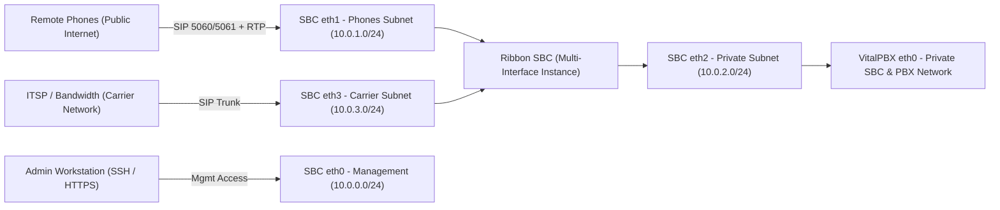

# AWS Infrastructure Configuration - Ribbon SBC + VitalPBX Deployment

##  Overview
This Document is to provide the infastructure preamaraters in AWS to deploy Vital PBX and Ribbon SBC in AWS 

## Important Notes 
Both the Ribbon SBC and VitalPBX are deployed within the same AWS VPC.
This design allows the SBC and PBX to communicate securely over a private network while keeping the PBX isolated from the public internet.
Only the SBC exposes public interfaces for phone registration and carrier trunks.

This document focuses solely on the AWS infrastructure configuration required for deployment.
Please refer to the accompanying Ribbon SBC and VitalPBX configuration guides for application-level setup and integration steps.

## Table of Contents
1. [Overview](#overview)
2. [Important Notes](#important-notes)
3. [Step 1: VPC Creation & Subnet Design](#step-1-vpc-creation--subnet-design)
4. [Step 2: Create Four Subnets within VPC](#step-2-create-four-subnets-within-vpc)
5. [Step 3: Route Table Configuration](#step-3-route-table-configuration)
6. [Step 4: Create Security Groups](#step-4-create-security-groups)
   - [SBC Carrier SG](#sbc-carrier-sg)
   - [Phones SBC SG](#phones-sbc-sg)
   - [Private SBC SG](#private-sbc-sg)
   - [Private PBX SG](#private-pbx-sg)
   - [SBC Management SG](#sbc-management-sg)
7. [Step 5: EC2 Instance Deployments](#step-5-ec2-instance-deployments)
   - [VitalPBX Instance](#vitalpbx-instance)
   - [Ribbon SBC Instance](#ribbon-sbc-instance)
8. [Deployment Summary](#deployment-summary)
9. [Network Architecture Breakdown](#network-architecture-breakdown)
   - [Logical Layout](#logical-layout)
   - [Security Overview](#security-overview)
   - [Network Diagram](#network-diagram)
10. [Closing](#closing)
11. [Document Control](#document-control)

---

##  Step 1: VPC Creation & Subnet Design

### Create a Dedicated VPC in AWS 
- Choose the desired AWS region (e.g., `us-east-1`)
- Example CIDR block: `10.0.0.0/16`


---

##  Step 2: Create Four Subnets within VPC 

| Subnet Name | Purpose | Example CIDR | Notes |
|--------------|----------|--------------|-------|
| **SBC Management** | Admin access network for SBC | `10.0.0.0/24` | Private / restricted access |
| **Public Phones SBC** | Public interface for phones | `10.0.1.0/24` | Internet-facing via Elastic IP |
| **Private SBC & PBX** | Private interconnect between SBC & PBX | `10.0.2.0/24` | No internet access |
| **SBC Carrier** | Carrier/ITSP interconnect | `10.0.3.0/24` | Internet-facing via Elastic IP |


---

## Step 3: Route Table Configuration
- Public subnets route to the **Internet Gateway (IGW)**  
- Private subnets route **only within the VPC**


---

###  Route Table Setup

####  Public Route Table
- **Destination:** `0.0.0.0/0 → Internet Gateway`
- **Subnet Associations:**
  - SBC Management
  - Public Phones SBC
  - SBC Carrier

####  Private Route Table
- **Destination:** `Local (10.0.0.0/16)`
- **Subnet Associations:**
  - Private SBC & PBX

---

## Step 4: Create Security Groups

> Each subnet and instance gets its own Security Group (SG) for fine-grained traffic control.


---

###  SBC Carrier SG
Handles SIP trunking and RTP media from your carrier (e.g., Bandwidth).

**Inbound Rules**

| Protocol | Port Range | Source | Description |
|-----------|-------------|--------|-------------|
| UDP | 5060–5061 | Carrier IPs | SIP signaling |
| UDP | 10000–20000 | Carrier IPs | RTP media |

**Outbound Rules**

| Protocol | Port Range | Destination | Description |
|-----------|-------------|-------------|-------------|
| All | All | `0.0.0.0/0` | Allow return traffic |

---

###  Phones SBC SG
Handles registration and media from remote phones.

**Inbound Rules**

| Protocol | Port Range | Source | Description |
|-----------|-------------|--------|-------------|
| UDP | 5060–5061 | `0.0.0.0/0` | SIP signaling |
| UDP | 10000–12000 | `0.0.0.0/0` | RTP media |
| ICMP | All | MGMT IP | Ping testing |

**Outbound Rules**

| Protocol | Port Range | Destination | Description |
|-----------|-------------|-------------|-------------|
| UDP | 5060–5061 | `0.0.0.0/0` | SIP signaling out |
| UDP | 10000–12000 | `0.0.0.0/0` | RTP |
| UDP | 53 | `0.0.0.0/0` | DNS |
| UDP | 123 | `0.0.0.0/0` | NTP |
| ICMP | All | MGMT IP | Diagnostics |

---

###  Private SBC SG
Used for the private interface between SBC and PBX.

| Direction | Protocol | Ports | Source/Destination | Description |
|------------|-----------|--------|--------------------|-------------|
| **Inbound** | All | All | Private PBX SG | Allow PBX→SBC |
| **Outbound** | All | All | Private PBX SG | Allow SBC→PBX |

---

###  Private PBX SG
Used for the PBX private interface.

| Direction | Protocol | Ports | Source/Destination | Description |
|------------|-----------|--------|--------------------|-------------|
| **Inbound** | All | All | Private SBC SG | Allow SBC→PBX |
| **Outbound** | All | All | Private SBC SG | Allow PBX→SBC |

---

###  SBC Management SG
For SBC web/CLI administration only.

**Inbound Rules**

| Protocol | Port | Source | Description |
|-----------|-------|---------|-------------|
| TCP | 443 | Your Admin IP | Web UI (HTTPS) |
| TCP | 22 | Your Admin IP | SSH CLI access |

**Outbound Rules**

| Protocol | Port(s) | Destination | Description |
|-----------|----------|-------------|-------------|
| TCP | 80, 443 | `0.0.0.0/0` | Updates, licensing |
| UDP | 53 | `0.0.0.0/0` | DNS |
| UDP | 123 | `0.0.0.0/0` | NTP |
| ICMP | All | `0.0.0.0/0` | Diagnostics |

---

## Step 5: EC2 Instance Deployments

###  VitalPBX Instance
<table style="border:none; border-collapse:collapse;">
<tr>
<td style="border:none; vertical-align:top; width:60%; padding-right:25px;">

1. Launch a **Debian 12 EC2 instance**
   - Select **Debian 12 AMI**
   - **Name:** `PBX`
   - **Type:** `m5.large` *(minimum for multi-tenant environments)*
   - **Storage:** `20+ GB gp3`
   - **Subnet:** Private SBC & PBX
   - **Do not** assign a Public IPv4 address
   - Attach the **Private PBX Security Group (SG)**
   - Assign an **SSH key pair** for secure CLI access

</td>
<td style="border:none; vertical-align:top; width:40%;">

</td>
</tr>
</table>

2. Connect to the VPC via SSH and install VitalPBX:
   ```bash
   sudo su
   wget https://repo.vitalpbx.com/vitalpbx/v4.5/pbx_installer.sh
   chmod +x pbx_installer.sh
   ./pbx_installer.sh

---

###  Ribbon SBC Instance

#### 1️. Launch the EC2 Instance
- **AMI:** Ribbon-provided shared image  
- **Instance Type:** `t3.medium` *(minimum)*  
- **Storage:** `40 GB gp3`  
- **VPC / AZ:** same as VitalPBX


---

#### 2️. Attach Four Network Interfaces

| Interface | Subnet | Purpose |
|------------|---------|----------|
| `eth0` | SBC Management | Admin Access |
| `eth1` | Public Phones SBC | Phones |
| `eth2` | Private SBC & PBX | Internal PBX trunk |
| `eth3` | SBC Carrier | Carrier / ITSP trunk |


---

#### 3. Attaching SGs and Selecting Key Pair
- Attach the correct **Security Groups (SGs)** to each interface — no edits needed  
- Assign an **SSH key pair** for secure CLI access

---

## Step 6: Assign Elastic IPs to Public Interfaces
- In AWS, under elastic IPs Select Allocate IP addresses
- Then assign the Public Elastic IPs to the desired Public Interfaces


---

## Deployment Summary

| Component | Interfaces | Subnets | Security Group | Elastic IP | Purpose |
|------------|-------------|----------|----------------|-------------|----------|
| **VitalPBX** | `eth0` | Private SBC & PBX | Private PBX SG | None | PBX Service |
| **Ribbon SBC** | `eth0–eth3` | MGMT, Phones, Private, Carrier | Matching SGs | Yes | SBC Service |

---

# Closing 

After completing these steps, your **AWS infrastructure is now fully deployed** — including all VPC, subnet, route table, and security group configurations necessary for operation.  
At this stage, both the **Ribbon SBC** and **VitalPBX** instances should be launched, reachable, and correctly networked within the VPC.

To continue, please refer to the following configuration guides for system-level setup:

- **[VitalPBX Configuration Guide](#)** -
- **[Ribbon SBC Configuration Guide](#)** - 
- **[Ribbon SBC HA Guide](#)** - 
- **[Vital PBX HA Guide](#)** - 

Once both platforms are configured according to their respective guides, the full **SBC–PBX–Carrier architecture** will be operational and ready for service.

---

## Network Architecture Breakdown

###  Logical Layout

| Subnet | Purpose | Example CIDR | Connected Interfaces |
|---------|----------|--------------|----------------------|
| **SBC Management** | Admin access network for SBC | `10.0.0.0/24` | SBC `eth0` |
| **Public Phones SBC** | Public interface for phones | `10.0.1.0/24` | SBC `eth1` |
| **Private SBC & PBX** | Private internal network | `10.0.2.0/24` | SBC `eth2`, PBX `eth0` |
| **SBC Carrier** | Carrier / ITSP interconnect | `10.0.3.0/24` | SBC `eth3` |

---

##  Security Overview

| Component | Inbound Access | Outbound Access |
|------------|----------------|-----------------|
| **SBC Management SG** | HTTPS (443), SSH (22) from admin IPs | DNS, NTP, Updates |
| **Phones SBC SG** | SIP (5060–5061), RTP (10000–12000) | SIP, RTP, DNS, NTP |
| **SBC Carrier SG** | Carrier SIP/RTP IPs only | All outbound |
| **Private SBC / PBX SGs** | Full bidirectional | Internal only |

---
##  Network Diagram


--- 

### Document Control

**Title:** AWS Infrastructure Configuration — Ribbon SBC + VitalPBX Deployment  
**Applies To:** XBLUE Product Management  
**Author:** Dylan Gilchrist  
**Last Updated:** October 2025  
**Version:** 1.4
